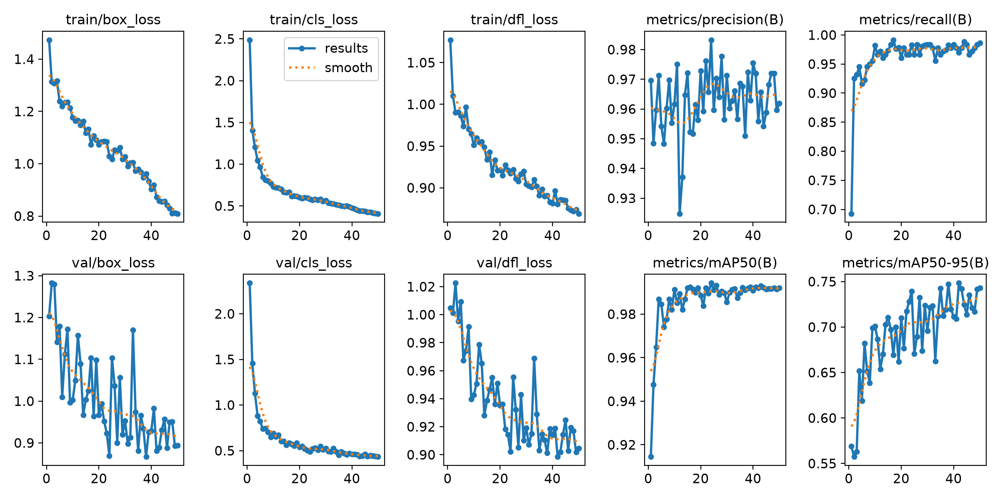
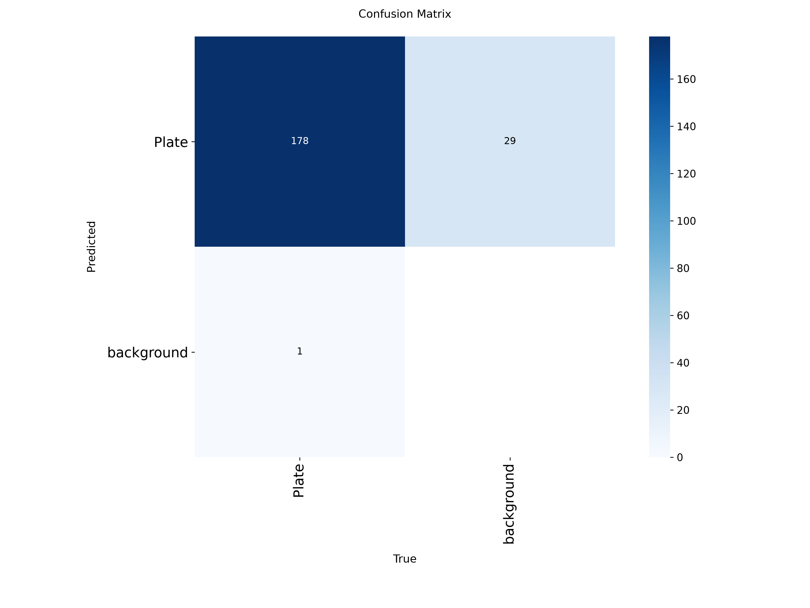

# Smart Automatic License Plate Recognition (ALPR)

<div align="center">
  
  
  
  
  
</div>

<div align="center">
  <h3>
    <a href="https://alprsystem.streamlit.app/">🚀 Try the Live Demo here!</a>
  </h3>
</div>

<br>

**Smart ALPR System** adalah sistem cerdas _end-to-end_ untuk mendeteksi kendaraan, memotong (_crop_) area plat nomor secara akurat, dan membaca teks plat nomor kendaraan Indonesia secara dinamis di lingkungan _real-world_.

Proyek ini dibangun dengan memadukan kekuatan **Instance Segmentation** dari YOLOv8 dan keakuratan pembacaan teks **PaddleOCR**, dibungkus dalam antarmuka web modern berbasis Streamlit (menggunakan gaya _Glassmorphism_).

---

## Fitur Utama

- **Deteksi Presisi Tinggi:** Mampu mendeteksi berbagai jenis kendaraan (Mobil, Motor, Truk, Bus) sekaligus memotong plat nomornya.
- **Optical Character Recognition (OCR):** Menggunakan PaddleOCR yang telah di-tuning agresif (Binarization & Box Thresh rendah) agar tangguh membaca font plat nomor yang tipis atau miring.
- **Smart Context-Aware Formatting:** Hasil bacaan mentah dari OCR tidak ditelan mentah-mentah. Sistem dibekali logika berbasis blok (_Prefix - Number - Suffix_) yang sangat cerdas untuk membedakan huruf dan angka berdasarkan posisinya. Sistem secara otomatis memperbaiki kebingungan OCR secara presisi (contoh: angka `6` di blok depan dikoreksi menjadi kode wilayah `G`, angka `0` di blok belakang dikoreksi menjadi `O`), tanpa pernah merusak blok angka seri murni. Hasil akhirnya dijamin rapi dan valid (misal: `W 1185 ZO`).
- **UI/UX Premium:** Antarmuka bergaya _Glassmorphism_ (efek tembus pandang/kaca) dengan tata letak hasil dalam bentuk Tabel, memberikan impresi profesional seperti aplikasi tingkat _Enterprise_.
- **Super Cepat:** Menggunakan varian `YOLOv8s-seg` yang jauh lebih ringan dibanding model konvensional, sangat cocok untuk inferensi dengan CPU maupun GPU.

---

## Teknologi yang Digunakan

- **Computer Vision Framework:** [Ultralytics YOLOv8](https://github.com/ultralytics/ultralytics) (Detection & Segmentation).
- **OCR Engine:** [PaddleOCR](https://github.com/PaddlePaddle/PaddleOCR) (Jauh lebih unggul dibanding Tesseract untuk bacaan _in-the-wild_).
- **Web Framework:** [Streamlit](https://streamlit.io/) (Untuk Frontend UI).
- **Image Processing:** OpenCV (`cv2`) & NumPy (Untuk pre-processing dan ekstraksi potongan pelat nomor secara presisi sebelum diumpankan ke OCR).

---

## Instalasi

Ikuti langkah-langkah di bawah ini untuk menjalankan _project_ ini di komputer/laptop Anda secara lokal:

1. **Clone Repository**

   ```bash
   git clone https://github.com/Rezkunz/mini_project.git
   cd mini_project
   ```

2. **Buat Virtual Environment (Opsional tapi Direkomendasikan)**

   ```bash
   python -m venv venv
   # Untuk Windows:
   venv\Scripts\activate
   # Untuk Mac/Linux:
   source venv/bin/activate
   ```

3. **Install Dependencies**
   ```bash
   pip install -r requirements.txt
   ```
   _(Pastikan koneksi internet stabil karena PaddleOCR dan PyTorch membutuhkan ukuran download yang cukup besar)._

---

## Cara Pakai

Setelah semua dependensi terinstall, Anda hanya perlu menjalankan satu perintah sederhana:

```bash
python -m streamlit run app.py
```

**Panduan Penggunaan di Browser:**

1. Halaman web akan otomatis terbuka di `http://localhost:8501`.
2. Pada panel navigasi (Sidebar), pilih opsi unggah gambar.
3. Upload gambar kendaraan (bisa mobil, motor, dll) dari komputer Anda.
4. Klik tombol **Proses**.
5. AI akan melakukan _scanning_ dan memproses deteksi dalam beberapa detik.
6. Hasil pembacaan plat (bersama dengan gambarnya) akan disajikan dalam bentuk Tabel.

---

## Hasil Analisis Model

Pelatihan model Plat Nomor dilakukan pada arsitektur `YOLOv8n` dengan iterasi pada dataset plat nomor Indonesia. Berikut adalah grafik metrik performa (_Training Results_):

### 1. Training Metrics (Akurasi & Ketangguhan)

Berdasarkan log hasil _training_ pada _epoch_ ke-50, model pendeteksi plat nomor mencetak angka evaluasi yang sangat luar biasa:

- **Precision (Presisi): 96.19%** — Artinya, dari semua objek yang ditebak sebagai plat nomor, 96.19% di antaranya adalah benar-benar plat nomor (sangat sedikit deteksi palsu / _false positive_).
- **Recall (Sensitivitas): 98.62%** — Artinya, model berhasil menemukan 98.62% dari total seluruh plat nomor yang ada di dalam gambar (hampir tidak ada plat yang terlewat).
- **mAP50 (Mean Average Precision): 99.20%** — Menunjukkan ketangguhan model secara keseluruhan yang nyaris sempurna dalam mengenali area plat nomor pada kondisi standar.
- **mAP50-95: 74.30%** — Menunjukkan bahwa _bounding box_ (kotak deteksi) sangat ketat dan presisi menempel pada objek plat nomor.

Grafik di bawah ini memvisualisasikan penurunan tingkat kesalahan (_Loss_) secara konsisten selama iterasi _training_. Ini membuktikan bahwa model tidak mengalami _overfitting_ dan belajar dengan sangat stabil.



### 2. Confusion Matrix

Matrix kebingungan (_Confusion Matrix_) menunjukkan betapa akuratnya model dalam memprediksi kelas target (Plat Nomor) tanpa banyak melakukan _False Positive_ pada latar belakang (_background_).



---

<p align="center">
  <i>Dibuat untuk menunjang pengembangan Intelligent Transportation System (ITS) di Indonesia.</i>
</p>
